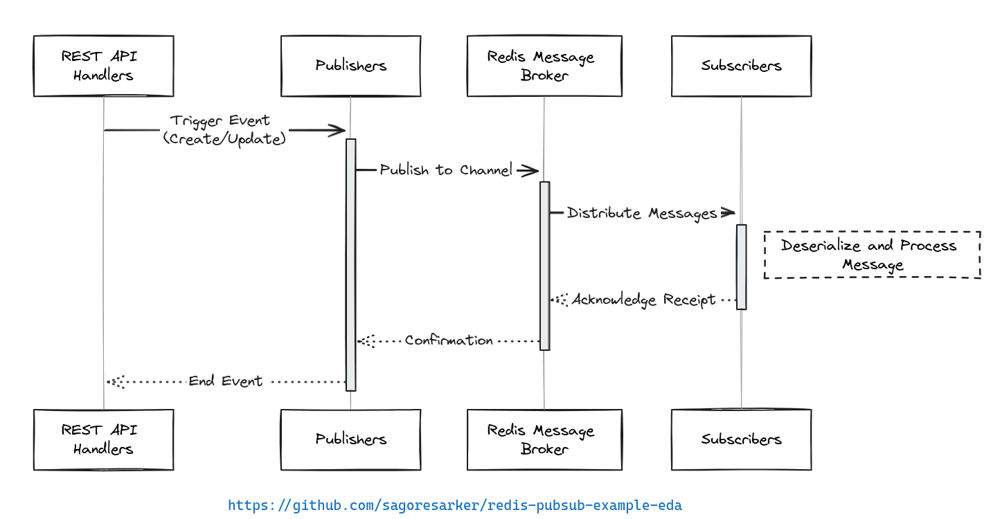

# Redis pub/sub system:
The architecture of the system is

The system is built using Go and Redis. It follows a publish-subscribe (pub/sub) architecture pattern, where events are published to Redis channels, and subscribers listen to these channels and react to the events asynchronously.

The main components are:

1. **Publishers**: Components that publish events (messages) to Redis channels. In this system, the publishers are triggered by the REST API handlers when creating or updating users or orders.

2. **Redis**: The central message broker that receives published messages and delivers them to the appropriate subscribers.

3. **Subscribers**: Components that listen to specific Redis channels and handle the received messages. The subscribers in this system log the events and can potentially perform additional actions based on the event type (e.g., user creation, order update).

The flow is as follows:

1. A client sends a request to the REST API (e.g., create a user, update an order).
2. The API handler processes the request and publishes a message to the corresponding Redis channel (e.g., `user.created`, `order.updated`) using the publisher component.
3. Redis receives the published message and delivers it to the subscribed channels.
4. The subscriber component, which is listening to the relevant channels, receives the message and handles it accordingly (e.g., logs the event, performs additional actions).

